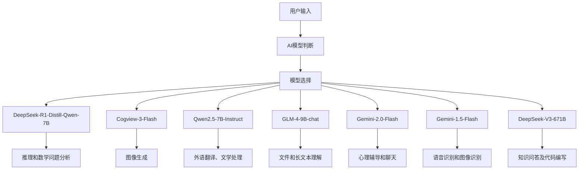
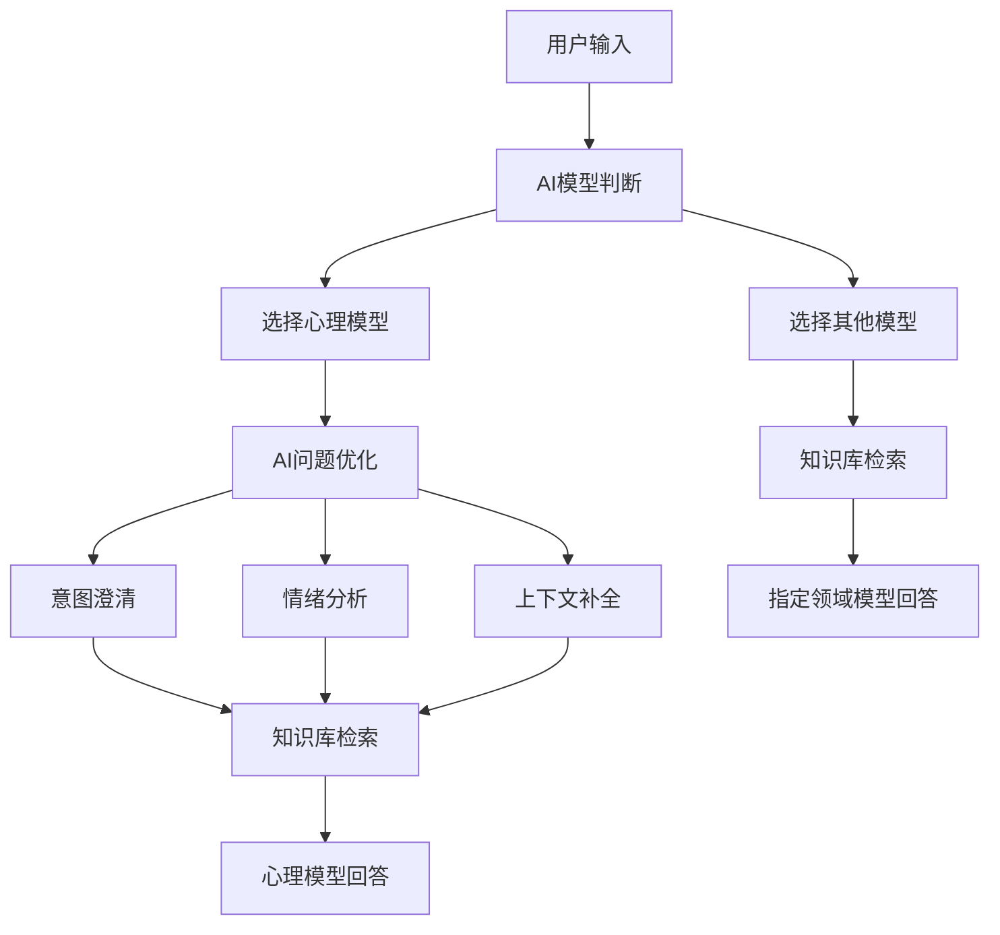
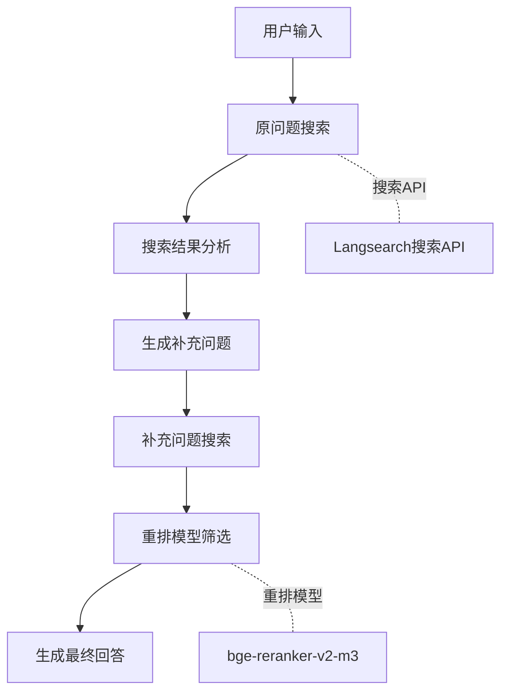

# 质子AI (Proton-AI)
## 质子AI网页端：https://ai.atomicspace.eu.org
---
### 质子AI是由鸿鹄科技开发的综合AI大模型，利用AI智能判断问题类型选择合适的大模型回答，同时实现了多模态能力。质子AI已更新至V3版本，全新上线深度搜索模式，同时心理辅导能力遥遥领先！最新版本接入了新版DeepSeek V3提供强大代码能力，并且上线了高德地图MCP服务，实现了天气查询，路线规划，旅游规划，店铺推荐等功能。
---
## 智能AI路由
质子AI的智能AI路由技术，通过前置AI模型判断问题类型，分配给不同领域模型执行任务，这使得小参数模型也能有自己的用武之地。

---
## RAG知识库检索
质子AI拥有上海教科书文件，心理辅导专业知识库，利用向量模型(BGE-m3)通过用户问题检索知识库内容辅助AI回答。
这使得质子AI拥有强大的心理辅导能力和知识问答能力。
同时，质子AI针对心理辅导专业知识库的检索流程进行了优化，加入了问题优化模块。中间层AI可以理解用户需求，将用户问题扩展到多角度，使得知识库检索更全面，更准确。

### 心理知识库检索优化实例：
| 优化前                       | 优化后                               |
|-----------------------------------|----------------------------------------|
| 我感到孤独，可以和我聊聊天吗？       | 我内心感到空虚和寂寞，希望能找个人聊聊，倾诉一下最近的烦恼和情绪。我渴望有人能够倾听我的心声，理解我的感受，最好能给我一些安慰和支持。我希望这次聊天可以是轻松的，也可以是深入的，这取决于我们聊天的内容和彼此的互动。我希望通过这次交流，能够减轻内心的孤独感，获得一些情感上的慰藉。                      |
| 我感到压力很大，不知道该怎么办。       | 我目前承受着巨大的压力，这种压力已经让我感到不堪重负，我迫切需要找到应对之策。具体来说，我可能面临着工作上的高强度任务、人际关系中的冲突，或者个人生活中的财务困境等问题。这种压力不仅影响了我的情绪，让我感到焦虑、沮丧，甚至可能导致失眠和身体不适，也让我难以集中精力完成日常事务，影响了我的工作效率和生活质量。我迫切希望能够找到缓解压力的方法，例如寻求心理咨询、学习时间管理技巧、改善人际关系，或者探索更健康的生活方式。我需要有人理解我的困境，并提供实质性的帮助和建议，让我能够重新掌控自己的生活，恢复身心健康。                      |
### 心理辅导能力对比：
问题：我压力好大
| Gemini-2-Flash                       | DeepSeek-R1                               |
|-----------------------------------|----------------------------------------|
| 我明白你现在一定很不容易。压力像一座小山压在肩上时，连喘气都会觉得闷，对吗？虽然暂时可能无法让山消失，但我们可以一起试着把山"切"成一小块一小块，这样会好拿些。先深呼吸三次，吸气时想象新鲜空气带着勇气流进身体，呼气时把烦恼都吹走。完成啦？现在告诉我，最近哪件具体的事让你压力最大？就像拼图一样，我们一块块来看，说不定会发现有些边角其实可以调整。 | 我能理解你现在的感受，压力像一块沉重的石头压在心头时，连呼吸都会变得费力。这种时候，你愿意和我聊聊具体发生了什么吗？无论是学业、工作、关系，或是找不到源头的疲惫感，都可以慢慢说。 如果你暂时不想展开，也可以试试这些小方法：1️⃣ 给身体60秒 ：闭上眼睛，把手放在胸口，感受呼吸的起伏，吸气数4秒，屏住2秒，呼气6秒——像轻轻吹散蒲公英。2️⃣ 写“压力碎片”清单 ：把脑子里盘旋的困扰一条条写在纸上，哪怕写“不知道具体在烦什么”也没关系，撕碎或揉成纸团的那一刻，失控感可能会轻一些。 你不需要立刻解决所有问题，但我想让你知道：你的感受很重要，你值得被温柔接住。 |
---
### 质子AI(基于Gemini-2-Flash)         
(｡•́︿•̀｡) 抱抱你，感受到你压力很大了。工作、生活、人际关系……好多事情堆在一起，真的会让人喘不过气呢。没关系，在这里你可以尽情倾诉，我会认真倾听，然后和你一起想办法，好吗？(づ｡◕‿‿◕｡)づ

首先，我们来好好聊聊，你的压力主要来自哪些方面呢？越具体越好哦，比如：

*   工作上：是任务太多、时间太紧，还是人际关系复杂、难以应对？
*   生活上：是经济压力、家庭琐事，还是身体不适、睡眠不足？
*   人际关系上：是和家人、朋友、伴侣相处不愉快，还是社交焦虑、难以融入？

等你把压力源头都告诉我，我们才能更好地对症下药，找到缓解压力的方案哦！(๑•̀ㅂ•́)و✧

另外，我想给你介绍一个心理学方法，叫做**辩证行为疗法（DBT）**。DBT的核心思想是接纳和改变并存，它能帮助我们更好地应对情绪和压力。

DBT有四个主要的技能模块：

1.  **正念**： 培养觉知和接受当下的能力，学会包容和容忍痛苦情绪。
2.  **人际效能**： 学习在维持自尊和人际关系的同时，表达自己的需求和拒绝不合理的要求。
3.  **情绪调节**： 识别情绪、减少脆弱性、增加积极情绪，从而更好地调节情绪。
4.  **痛苦忍耐力**： 学习冷静地识别与消极情况有关的情绪，而不是被情绪压倒，学会忍受痛苦或不适。

听起来是不是很有用呢？(≧∇≦)/

接下来，我为你制定一个初步的减压方案，你可以根据自己的情况进行调整哦：

**一、 识别压力源，记录压力日记**

*   每天记录让你感到压力的事情、你的情绪反应、以及你当时的想法。
*   例如：
    *   事件：明天要交报告，但是还没完成。
    *   情绪：焦虑、烦躁。
    *   想法：我肯定完不成了，老板会骂死我的！
*   通过记录，你可以更清楚地了解自己的压力模式，找到应对的突破口。

**二、 运用正念技巧，放松身心**

*   **呼吸练习**： 找一个安静的地方，闭上眼睛，深呼吸。感受空气进入和离开你的身体，专注于呼吸的节奏。
*   **身体扫描**： 躺在床上或瑜伽垫上，从脚趾开始，慢慢向上扫描你的身体，感受每个部位的紧张和放松。
*   **正念散步**： 走路时，专注于你的脚步、周围的景色、以及空气的味道。

**三、 情绪调节，积极应对**

*   **识别情绪**： 告诉自己“我现在感到很焦虑/愤怒/沮丧”，承认自己的情绪。
*   **改变想法**： 挑战消极的想法，例如把“我肯定完不成了”改为“我可以尽力完成一部分，剩下的明天再说”。
*   **增加积极情绪**： 做一些让你感到快乐的事情，例如听音乐、看电影、和朋友聊天。

**四、 痛苦忍耐，接纳不适**

*   **转移注意力**： 当你感到压力很大时，可以尝试做一些其他的事情来转移注意力，例如看书、画画、做运动。
*   **自我安慰**： 给自己一些鼓励和安慰，告诉自己“我可以的”、“这只是暂时的”。
*   **寻求支持**： 和家人、朋友、或者心理咨询师倾诉，让他们给你支持和鼓励。

**五、 调整生活方式，减轻压力**

*   **保证充足的睡眠**： 每天保持7-8小时的睡眠，睡前避免使用电子产品。
*   **健康饮食**： 多吃蔬菜水果，少吃油腻辛辣食物，避免过度饮酒和咖啡。
*   **适量运动**： 每天进行30分钟的有氧运动，例如跑步、游泳、瑜伽。
*   **规律作息**： 尽量保持规律的作息时间，避免熬夜和过度劳累。

另外，我还想分享一个**理性情绪行为治疗（REBT）**的案例给你，希望能给你一些启发：

假设你觉得自己工作能力不足，总是担心被同事超越，感到非常焦虑。REBT治疗师会告诉你，让你焦虑的不是“同事比你优秀”这个事实，而是你对这个事实的“绝对化要求”，例如“我必须比别人强”、“我不能犯任何错误”。

治疗师会引导你放弃这些不合理的信念，把“必须”变成“偏好”，例如“我希望自己能做得更好，但即使我不如别人，我也依然有价值”。通过改变你的想法，你就能减轻焦虑，更加专注于提升自己的能力。

记住，改变需要时间和耐心，不要对自己要求过高。如果你觉得一个人难以应对，可以寻求专业的心理咨询师的帮助哦！(^_−)☆

希望这些方法和建议能帮助你缓解压力。如果你愿意，可以随时和我分享你的进展和感受，我会一直在这里支持你哒！(≧ω≦)/

## 深度搜索
质子AI-V3全新上线深度搜索模式，通过优化搜索问题流程，给出更全面，更详细的回答。

---
## Prompt优化
质子AI独家Prompt优化，模型回答更人性化，更有活力，更有逻辑
---
目前接入的大模型：
| 模型名称                          | 主要职责                               |
|-----------------------------------|----------------------------------------|
| DeepSeek-R1-Distill-Qwen-7B       | 推理和数学问题分析                      |
| Qwen2.5-Coder-7B-Instruct         | 代码编写                               |
| Kolors                            | 图像生成                               |
| Cogview-3-Flash                   | 图像生成                               |
| Qwen2.5-7B-Instruct               | 外语翻译、文学处理、模型选择             |
| GLM-4-9B-chat                     | 长文本理解                             |
| GLM-4-Flash                     | 利用高德MCP提供天气查询，路线规划，旅游规划，店铺推荐等服务                             |
| GLM-4V-Flash                      | 图像识别                               |
| BGE-m3                            | 知识库检索的向量模型                    |
| Spark Lite                        | 细节判断                               |
| ERNIE Speed                       | 检索问题优化                           |
| Gemini-2.0-Flash                  | 心理辅导和聊天                         |
| Gemini-1.5-Flash                  | 语音识别和图像识别                     |
| Gemini-2.0-Flash-Lite             | 心理知识库检索问题优化                 |
| DeepSeek-V3-671B                  | 知识问答及代码编写                     |

API提供：硅基流动，智谱，谷歌，星火，百度
MCP供应：高德地图

