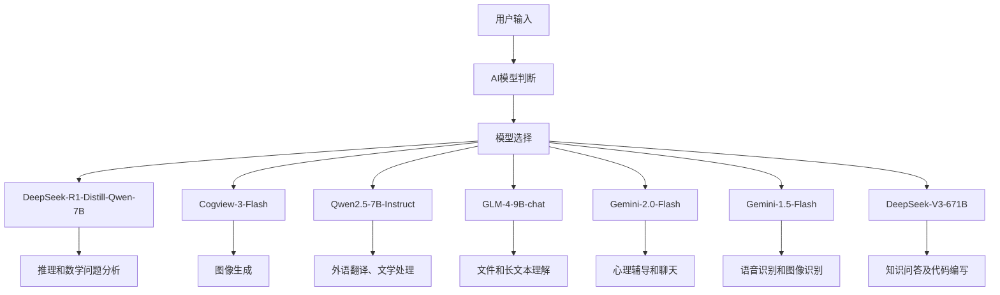
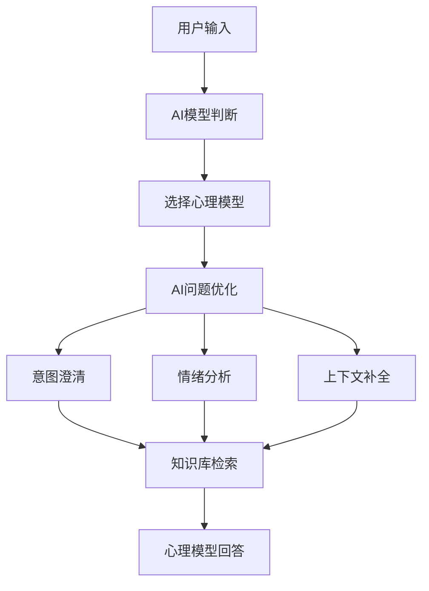

# 质子AI (Proton-AI)
### 质子AI网页端：https://ai.atomicspace.eu.org
### 质子AI已更新至V2版本，心理辅导能力遥遥领先！最新版本已接入新版V3提供强大代码能力
### 质子AI是由鸿鹄科技开发的综合AI大模型，利用AI智能判断问题类型选择合适的大模型回答，同时实现了多模态能力
---
### 智能AI路由
质子AI的智能AI路由技术，通过前置AI模型判断识别类型，分配给不同领域模型执行任务，这使得小参数模型也能有自己的用武之地。

---
### RAG知识库检索
质子AI拥有上海教科书文件，心理辅导专业知识库，利用向量模型(BGE-m3)通过用户问题检索知识库内容辅助AI回答。
这使得质子AI拥有强大的心理辅导能力和知识问答能力。
同时，质子AI针对心理辅导专业知识库的检索流程进行了优化，加入了问题优化模块。中间层AI可以理解用户需求，将用户问题扩展到多角度，使得知识库检索更全面，更准确。

### 例：
| 优化前                       | 优化后                               |
|-----------------------------------|----------------------------------------|
| 我感到孤独，可以和我聊聊天吗？       | 我内心感到空虚和寂寞，希望能找个人聊聊，倾诉一下最近的烦恼和情绪。我渴望有人能够倾听我的心声，理解我的感受，最好能给我一些安慰和支持。我希望这次聊天可以是轻松的，也可以是深入的，这取决于我们聊天的内容和彼此的互动。我希望通过这次交流，能够减轻内心的孤独感，获得一些情感上的慰藉。                      |
| 我感到压力很大，不知道该怎么办。       | 我目前承受着巨大的压力，这种压力已经让我感到不堪重负，我迫切需要找到应对之策。具体来说，我可能面临着工作上的高强度任务、人际关系中的冲突，或者个人生活中的财务困境等问题。这种压力不仅影响了我的情绪，让我感到焦虑、沮丧，甚至可能导致失眠和身体不适，也让我难以集中精力完成日常事务，影响了我的工作效率和生活质量。我迫切希望能够找到缓解压力的方法，例如寻求心理咨询、学习时间管理技巧、改善人际关系，或者探索更健康的生活方式。我需要有人理解我的困境，并提供实质性的帮助和建议，让我能够重新掌控自己的生活，恢复身心健康。                      |
---
### Prompt优化
质子AI独家Prompt优化，模型回答更人性化，更有活力，更有逻辑
---
目前接入的大模型：
| 模型名称                          | 主要职责                               |
|-----------------------------------|----------------------------------------|
| DeepSeek-R1-Distill-Qwen-7B       | 推理和数学问题分析                      |
| Qwen2.5-Coder-7B-Instruct         | 代码编写                               |
| Kolors                            | 图像生成                               |
| Cogview-3-Flash                   | 图像生成                               |
| Qwen2.5-7B-Instruct               | 外语翻译、文学处理、模型选择             |
| GLM-4-9B-chat                     | 长文本理解                             |
| GLM-4V-Flash                      | 图像识别                               |
| BGE-m3                            | 知识库检索的向量模型                    |
| Spark Lite                        | 细节判断                               |
| ERNIE Speed                       | 检索问题优化                           |
| Gemini-2.0-Flash                  | 心理辅导和聊天                         |
| Gemini-1.5-Flash                  | 语音识别和图像识别                     |
| Gemini-2.0-Flash-Lite             | 心理知识库检索问题优化                 |
| DeepSeek-V3-671B                  | 知识问答及代码编写                     |

API提供：硅基流动，智谱，谷歌，星火，百度

